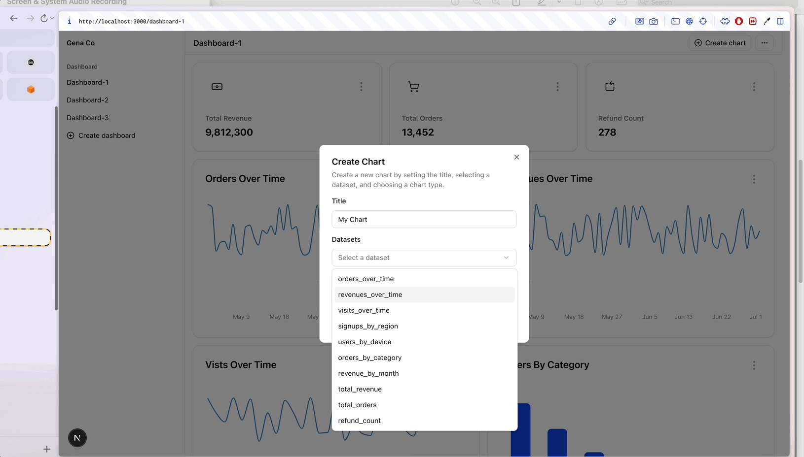

# 💬 Dashboard App

A Dashboard App for the Gena take-home assignment

## 📺 Demo

- [Public Demo](https://gena-co-take-home-production.up.railway.app/)

## How to run

To run the project:

- Clone this repository
- Navigate to the cloned repository and run `npm install`
- After installed, start the server by `npm run dev`

## 📕 Tech Stacks

- **Frameworks**: Next.js, React, Tailwind
- **Styling**: Shadcn/ui, Tailwind
- **Charts**: Recharts
- **Etc**: Tanstack Query, date-fns

## 👉 Features

**Requirements**

- ~You should mock the backend (via /api/ endpoints, JSON server, or other mocking tools)~ : Mocked with /api/endpoints
- ~A dashboard should consist of one or more charts.~
- ~A chart can be one of:~
  - ~A single number (e.g., total revenue)~
  - ~A line chart (e.g., orders over time)~
  - ~A bar chart (e.g., users by region)~
- ~Users should be able to:~
  - ~Create new dashboards~
  - ~Add and configure charts in dashboards~
  - ~Save and return to view dashboards later~

**Optional / Nice to Have:**

- Reorder charts on the dashboard (e.g. drag and drop)
- ~Rename or delete dashboards~
- ~Responsive or mobile-friendly layout~
- Dockerization or deployed demo

## 📩 Contacts

- 📪 k3hppk@gmail.com
- 📞 +82 1049931290
